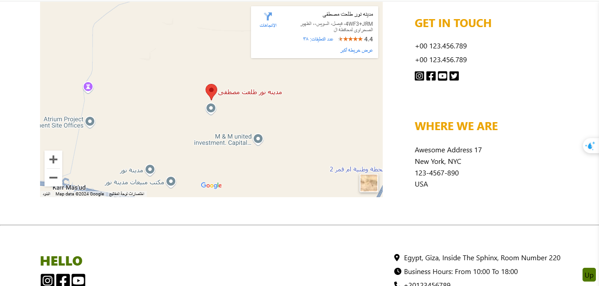
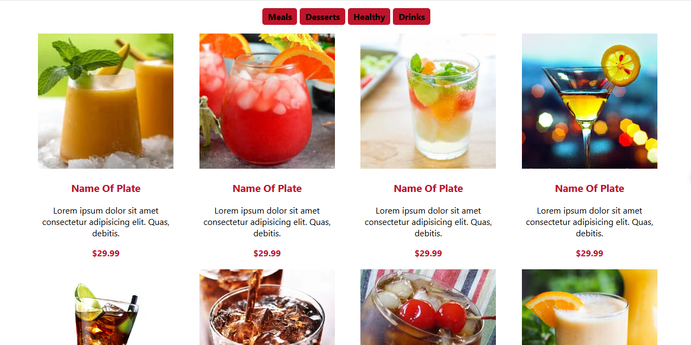
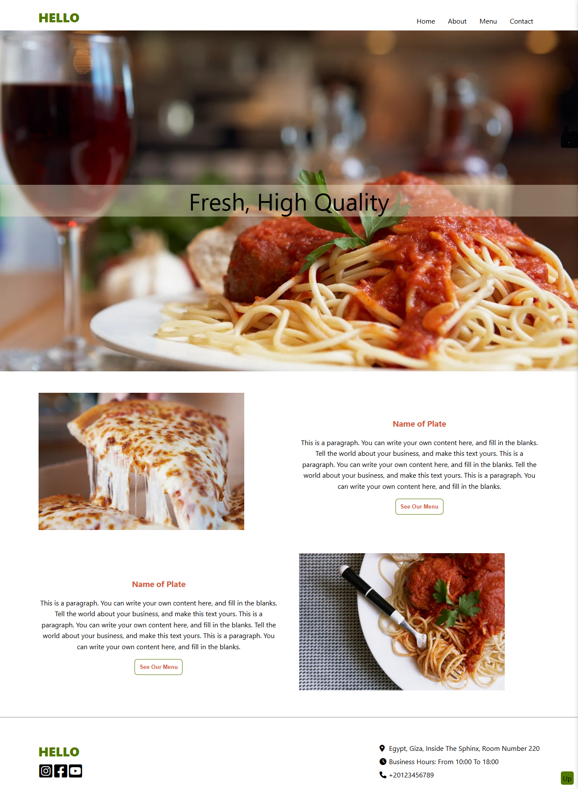
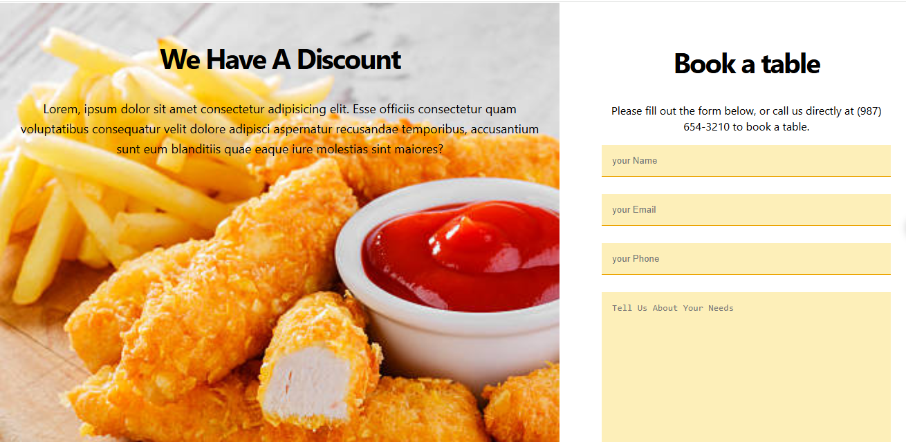

# myresturant-react-styled-components

This is a small resturant project created with react[hooks] and styled-components .it contans many pages we route between them using react-router. and the project has json file and we use axios to get data from it 

in this project i tried to use new feature like [styled-components, axios ,react-router]


## Table of contents

- [Overview](#overview)
- [Components](#Components)
- [Installation](#Installation)
- [Usage](#Usage)
- [Links](#Links)
- [Screenshot](#Screenshot)
- [What I learned](#what-i-learned)
- [Continued development](#continued-development)
- [Author](#author)


## overview
This is a small resturant project created with react[hooks] and styled-components .it contans many pages we route between them using react-router. and the project has json file and we use axios to get data from it 

in this project i tried to use new feature like [styled-components, axios ,react-router]


## Components

is contans many components like app, home,header,about,footer,contact,menu,desserts,drinks,meals,healthy,photo,up .........

## Installation
To get started with this project, follow these steps:

you can clone the project or download it as Zip file.
1. Clone the repository:
   ```bash
   git clone https://github.com/olahasan/myresturant-react-styled-components.git

2. Navigate to the project directory:
   cd <project-directory>

3. Install the required dependencies:
   npm install   


## Usage
To run the application, use the following command:

npm start


## Links

If you want to open the link in a new tab, you can:

- Press **Ctrl** (or **Cmd** on Mac) while clicking the link.
- Right-click the link and select **Open link in new tab**.

Otherwise, all links will open in the same tab.


- Solution URL: [here](https://github.com/olahasan/myresturant-react-styled-components)

- Live Site URL: [here](https://myresturant-react-styled-components.netlify.app/) 

 ## Screenshot
 






## what-i-learned
Through this project:
1. I learned in this simple project how to create react app and treat with function component,
2. how to deal with **Hooks**
3. how to deal with **axios"**
4. how to deal with **styled-components**
5. how to deal with **react-router**
6. how to deploy it on **netlify**
7. 
## Continued Development
In the future, I plan to:
- learn reactJs Hooks.
- learn redux toolkit with reactJs Hooks.

### Author

GitHub - @olahasan
